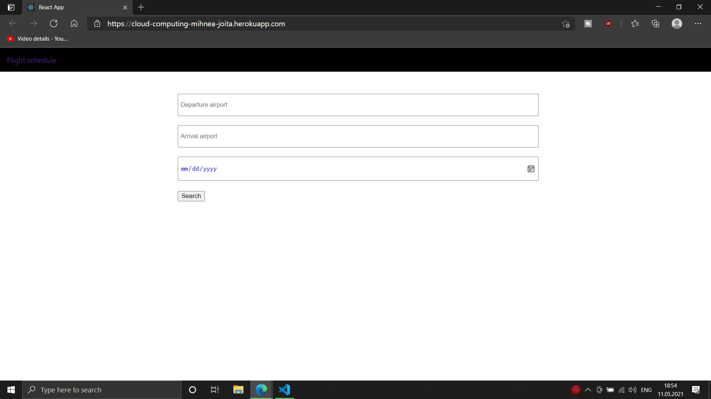
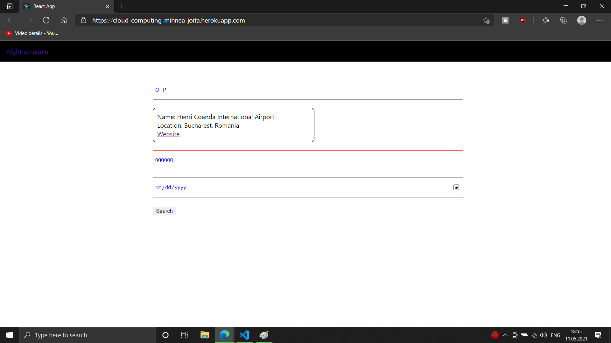
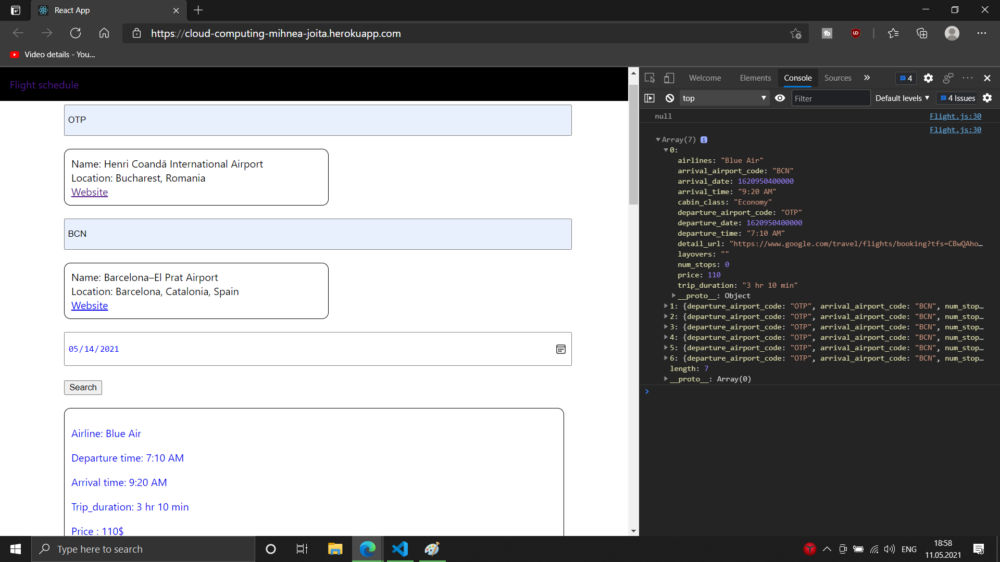

# cloud-computing

**Introducere**

Link-ul pentru aplicatia creata, incarcat pe Heroku: https://cloud-computing-mihnea-joita.herokuapp.com/

Aceasta aplicatie a fost realizata folosind Node.js si React. Scopul ei este de a usura munca utilizatorilor care doresc sa ajunga dintr-o locatie in alta folosind ca mijloc de transport avionul. Tot ce are de facut utilizatorul este sa introduca codul aeroportului de plecare, codul aeroportului de sosire si eventual data de la care se doresc sa fie vazute zborurile.

API-urile integrate sunt luate de pe rapidapi.com, iar ambele sunt gratuite. Numele acestora sunt Airport Info si Google Flights Search API. Ambele folosesc codul aeroporturilor, unul pentru a gasi aeroporturile, iar celalat pentru a gasi toate zborurile dintre cele 2 aeroporturi.

**Descriere problemă**

Aplicatia creata nu necesita conturi si poate fi folosita de oricine, oricand, doar cu conditia de a avea o conexiune la internet. Utilizatorii trebuie sa introduca codul aeroporturilor (cel de plecare si cel de sosire) sub forma IATA sau ICAO. Dupa ce informatia a fost captata, aplicatia va returna toate zborurile dintre aeroporturile respective. O data ce un zbor a fost accesat, utilizatorul va fi trimis pe un al website de unde isi poate cumpara un bilet.

**Descriere API**

Arhitectura utilizata in aplicatie este REST API. Am folosit router-ul din Express pentru a crea endpointuri pentru diferite tipuri de requesturi. Clientul si serverul sunt legate prin Axios, acesta apeland endpointurile create. Ambele API-uri necesita doar cele 2 coduri introduse de utilizator, iar API-ul pentru zboruri mai poate folosi si data la care utilizatorul doreste sa plece. API-ul Airport Info va afisa informatia despre aeroporturi, iar API-ul Google Flights va afisa informatia legata de zborurile dintre cele doua aeroporturi.

**Flux de date**

Pentru obtinerea informatiei am folosit un request de tip post catre "/airport" si catre "/flight", ambele endpointuri fiind apelate din React folosind pachetul Axios.
/airport - este apelat pe evenimentul de OnBlur al inputurilor
/flight  - este apelat in momentul in care se face submit formularului cu cele 2 coduri (si eventual data)

**Metode HTTP**

Am folosit o singura metoda HTTP, si anume POST. Acesta este folosit pentru a trimite date catre server, mai exact codurile introduse de catre utilizator. Nu am avut nevoie de GET, PUT si DELETE. In cazul in care as fi dorit ca utilizatorii sa isi creeze conturi, le-as fi folosit pentru a extrage, edita sau sterge informatii din baza de date.

**Autentificare și autorizare servicii utilizate**

Pentru utilizarea celor 2 API-uri a trebuit sa imi creez cont pe rapidapi.com pentru a putea folosi niste credentiale specifice pentru mine. Acestea sunt niste headere create automat de catre website pentru fiecare utilizator in parte.

Pentru Airport Info:

var request = unirest("GET", "https://airport-info.p.rapidapi.com/airport");

request.headers({
	"x-rapidapi-key": "20ba4a0a79mshfb2be2566e1b5c4p17d50bjsn67182507b2eb",
	"x-rapidapi-host": "airport-info.p.rapidapi.com",
	"useQueryString": true
});

Pentru Google Flights Search API:

var request = unirest("GET", "https://google-flights-search.p.rapidapi.com/search");

request.headers({
  "x-rapidapi-key": "20ba4a0a79mshfb2be2566e1b5c4p17d50bjsn67182507b2eb",
  "x-rapidapi-host": "google-flights-search.p.rapidapi.com",
  "useQueryString": true
});

**Capturi ecran aplicație**

**Referinte**
https://rapidapi.com/marketplace
